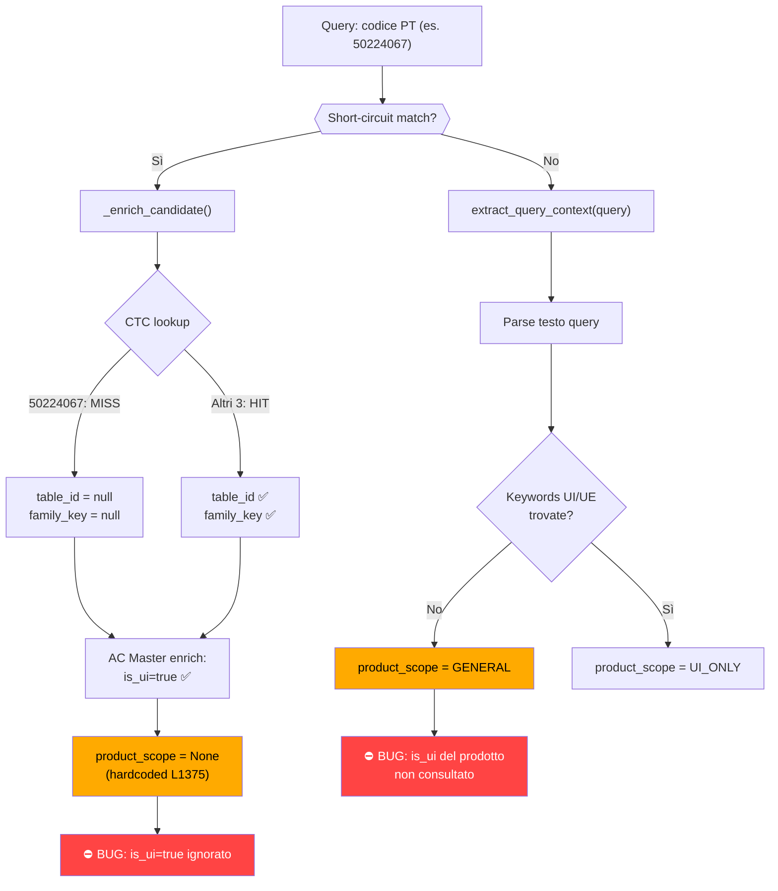

# Audit: Product Category / Product Role Resolution

> **Data di audit**: 2026-09-10  
> **Scope**: Verifica errori di Product Scope (GENERAL vs UI_ONLY) su prodotti exact match  
> **Nessuna modifica applicata a codice o dataset**

---

## 1. Dati Anagrafici Disponibili – Tabella Riepilogativa

| Campo | PT 50224067 | PT 99718206 | PT 99759971 | PT 50307791 |
|---|---|---|---|---|
| **MFG** | AS42XCAHRA-MB | FFA25A9 | FCAG71B | FTXM25A |
| **Nome** | UI EXPERT AS42XCAHRA-MB NERO | UI CASSETTA 600x600 FFA25A9 | UI CASSETTA ROUND FLOW FCAG 71B | UI PERFERA ALL SEASONS FTXM25A WI-FI |
| **Brand** | HAIER | DAIKIN | DAIKIN | DAIKIN |
| **CATEGORY_PATH** | CONDIZIONAMENTO > CONDIZIONAMENTO > RESIDENZIALI | CONDIZIONAMENTO > CONDIZIONAMENTO > COMMERCIALI | CONDIZIONAMENTO > CONDIZIONAMENTO > COMMERCIALI | CONDIZIONAMENTO > CONDIZIONAMENTO > RESIDENZIALI |
| **CATEGORY_ROOT** | CONDIZIONAMENTO ¹ | CONDIZIONAMENTO | CONDIZIONAMENTO | CONDIZIONAMENTO |
| **IS_UI** | ✅ true | ✅ true | ✅ true | ✅ true |
| **IS_UE** | ❌ false | ❌ false | ❌ false | ❌ false |
| **TAGLIA_BTU** | 15000 | 9000 | 24000 | 9000 |
| **ROLE** | ❌ assente | ❌ assente | ❌ assente | ❌ assente |

¹ `category_root` assente nel lookup, derivabile da `category_path`

---

## 2. Dati nelle Fonti Secondarie

### 2a. unified_catalog_master.json ✅

Tutti e 4 i prodotti sono presenti con:
- `category_root: "CONDIZIONAMENTO"`
- `is_ui: true`
- `is_ue: false`
- `taglia_btu` corretto

### 2b. climatizzatori_compatibilita_master.json (AC Master) ✅

| PT | Serie | Famiglia Catalogo | Tipologia |
|---|---|---|---|
| 50224067 | EXPERT (WHITE / BLACK) | EXPERT (WHITE / BLACK) | PARETE |
| 99718206 | FFA CASSETTA 60x60 FULL FLAT | FFA CASSETTA 60x60 FULL FLAT | CASSETTA_60X60 |
| 99759971 | FCAG ROUND FLOW CASSETTA 90x90 | FCAG ROUND FLOW CASSETTA 90x90 | CASSETTA_90X90 |
| 50307791 | PERFERA ALL SEASONS | PERFERA ALL SEASONS | PARETE |

### 2c. catalog_table_context.json (Root) e Knowledge/catalog_table_context.json

| PT | In CTC Root | In Knowledge CTC | Table ID | Family Key | Table Title |
|---|---|---|---|---|---|
| 50224067 | ❌ **ASSENTE** | ❌ **ASSENTE** | — | — | — |
| 99718206 | ✅ | ✅ | PDF_P0473_84E198812D | DAIKIN_CASSETTA_A_4_VIE_FFA_A_9_60X60 | CASSETTA A 4 VIE FFA-A (9) 60x60 |
| 99759971 | ✅ | ✅ | PDF_P0481_F8FD9D34C3 | DAIKIN_CASSETTA_DA_INCASSO_ROUND_FLOW_FCAG_B_90X90 | CASSETTA DA INCASSO ROUND FLOW FCAG-B 90X90 |
| 50307791 | ✅ | ✅ | PDF_P0468_648746C190 | DAIKIN_PERFERA_ALL_SEASONS | PERFERA ALL SEASONS |

> [!WARNING]
> **PT 50224067** (Haier Expert AS42XCAHRA-MB NERO) è assente da **entrambi** i catalog_table_context. La variante bianca (PT 50283866, `AS42XCAHRA-1`) è invece presente con family `EXPERT` a pagina 562. Il modello `-MB` (NERO) non ha corrispondenza diretta nel CTC.

### 2d. exact_code_lookup.json (Vector Index)

| PT | Presente | is_ui | category_root | catalog_family | family_key | table_id | role |
|---|---|---|---|---|---|---|---|
| 50224067 | ✅ | true | ❌ **assente** | ❌ **assente** | ❌ **assente** | ❌ **assente** | ❌ **assente** |
| 99718206 | ✅ | true | ❌ **assente** | ❌ **assente** | ❌ **assente** | ❌ **assente** | ❌ **assente** |
| 99759971 | ✅ | true | ❌ **assente** | ❌ **assente** | ❌ **assente** | ❌ **assente** | ❌ **assente** |
| 50307791 | ✅ | true | ❌ **assente** | ❌ **assente** | ❌ **assente** | ❌ **assente** | ❌ **assente** |

> [!IMPORTANT]
> Il campo `role` **non esiste in nessuna fonte dati**. Non è presente nel unified_catalog_master, nel AC master, nel CTC, né nel vector index. Il ruolo UI/UE è codificato esclusivamente tramite i flag booleani `is_ui`/`is_ue`.

### 2e. catalog_component_relations

| PT | Presente in v3_4 |
|---|---|
| 50224067 | ❌ (nessun record con questo PT come source/target) |
| 99718206 | ❌ |
| 99759971 | ❌ |
| 50307791 | ❌ |

I component_relations sono indicizzati per `table_id` e `family_key`, non per PT diretto.

---

## 3. Simulazione Routing: Dove si Perde l'Informazione

### Flusso per query di tipo exact match (es. query = "50224067"):

```
query = "50224067"
       │
       ▼
┌──────────────────────────────────────┐
│ STADIO 1: EXACT CODE SHORT-CIRCUIT   │
│ lookup["50224067"] → trovato          │
│ len(model_tokens) <= 1 ✅             │
│ len(words) <= 2 ✅                    │
│ → SHORT-CIRCUIT ATTIVO               │
└──────────┬───────────────────────────┘
           │
           ▼
┌──────────────────────────────────────┐
│ _enrich_candidate(item, climate_adap)│
│  1. CatalogTableContextIndex.enrich_ │
│     → 50224067 in CTC? ❌ (miss)     │
│     → table_id/family_key: null      │
│  2. climate.enrich_item(item)        │
│     → AC Master lookup: ✅ found     │
│     → is_ui=true, taglia_btu=15000   │
│     → famiglia_catalogo set          │
│     → family fallback COMPAT_MASTER  │
└──────────┬───────────────────────────┘
           │
           ▼
┌──────────────────────────────────────┐
│ SHORT-CIRCUIT RETURN                 │
│ product_scope: None  ← HARD-CODED   │
│                                      │
│ Il codice dice letteralmente:        │
│   "product_scope": None              │
│                                      │
│ NESSUN TENTATIVO di derivare scope   │
│ dal flag is_ui=true del prodotto     │
└──────────────────────────────────────┘
```

### Perché product_scope = GENERAL (o None)?

Il `product_scope` è calcolato **esclusivamente** da `extract_query_context(query)`, metodo che analizza il **testo della query**, NON i metadati del prodotto trovato.

```python
# climate.py L475-613: extract_query_context(query)
# Cerca nel testo: "UNITÀ INTERNA", "UNITÀ ESTERNA", "BTU", "MONOSPLIT", etc.
# Se nessuno di questi pattern è presente → product_scope = "GENERAL"
```

Per una query come `"50224067"` (un codice numerico puro), nessun keyword viene matchato:
- `has_ui_explicit` = False (nessun testo "UNITA INTERNA")
- `has_ue_explicit` = False
- `has_multi_kw` = False
- `has_mono_kw` = False
- `btus` = [] (nessun pattern BTU)
- → **product_scope = "GENERAL"**

Nel percorso short-circuit, `product_scope` è addirittura **hardcoded a `None`** alla riga 1375.

---

## 4. Analisi per Ogni Prodotto

### PT 50224067 — Haier Expert AS42XCAHRA-MB NERO

| Fase | Risultato | Note |
|---|---|---|
| Exact match | ✅ trovato nel lookup | |
| category_root | ✅ CONDIZIONAMENTO (da category_path) | derivabile ma non campo diretto |
| is_ui | ✅ true | nel lookup, nell'AC master, nel unified_catalog |
| AC Master | ✅ presente come UI, serie EXPERT | |
| CTC | ❌ **MANCANTE** | solo -1 (BCO) presente, -MB (NERO) assente |
| table_id | ❌ null post-enrichment | CTC miss → nessun table_id |
| family_key | ⚠️ da fallback COMPATIBILITY_MASTER | non da PDF_LAYOUT |
| **product_scope** | **None** (short-circuit hardcoded) | |
| **Atteso** | **UI_ONLY** | |
| **Component relations** | ✅ lookup possibile via family_key fallback | se non short-circuit |

### PT 99718206 — Daikin FFA25A9

| Fase | Risultato | Note |
|---|---|---|
| Exact match | ✅ trovato nel lookup | |
| category_root | ✅ CONDIZIONAMENTO | |
| is_ui | ✅ true | |
| AC Master | ✅ presente, FFA CASSETTA 60x60 | |
| CTC | ✅ table_id: PDF_P0473_84E198812D | |
| family_key | ✅ DAIKIN_CASSETTA_A_4_VIE_FFA_A_9_60X60 | da CTC |
| **product_scope** | **None** (short-circuit) | |
| **Atteso** | **UI_ONLY** | |

### PT 99759971 — Daikin FCAG71B

| Fase | Risultato | Note |
|---|---|---|
| Exact match | ✅ trovato nel lookup | |
| category_root | ✅ CONDIZIONAMENTO | |
| is_ui | ✅ true | |
| AC Master | ✅ presente, FCAG ROUND FLOW | |
| CTC | ✅ table_id: PDF_P0481_F8FD9D34C3 | |
| family_key | ✅ DAIKIN_CASSETTA_DA_INCASSO_ROUND_FLOW_FCAG_B_90X90 | |
| **product_scope** | **None** (short-circuit) | |
| **Atteso** | **UI_ONLY** | |

### PT 50307791 — Daikin FTXM25A

| Fase | Risultato | Note |
|---|---|---|
| Exact match | ✅ trovato nel lookup | |
| category_root | ✅ CONDIZIONAMENTO | |
| is_ui | ✅ true | |
| AC Master | ✅ presente, PERFERA ALL SEASONS | |
| CTC | ✅ table_id: PDF_P0468_648746C190 | |
| family_key | ✅ DAIKIN_PERFERA_ALL_SEASONS | |
| **product_scope** | **None** (short-circuit) | |
| **Atteso** | **UI_ONLY** | |

---

## 5. Verifica Component Relations Lookup

Dopo exact match (short-circuit), il motore possiede:

| Dato | 50224067 | 99718206 | 99759971 | 50307791 |
|---|---|---|---|---|
| PT (code) | ✅ | ✅ | ✅ | ✅ |
| is_ui / is_ue | ✅ / ✅ | ✅ / ✅ | ✅ / ✅ | ✅ / ✅ |
| table_id | ❌ null | ✅ (da CTC enrich) | ✅ | ✅ |
| family_key | ⚠️ fallback | ✅ (da CTC) | ✅ | ✅ |
| model (table_context) | ❌ null¹ | ✅ FFA25A9 | ✅ U.I. FCAG71B | ✅ U.I. FTXM25A |

¹ PT 50224067 non ha CTC entry → `table_context` è null → `model` non valorizzato dalla fonte PDF.

Il lookup `component_relations` funziona in cascata:
1. **EXACT_PRODUCT_PT**: cerca in `_contexts[code]` → **50224067 fallisce** (non in CTC)
2. **TABLE_ID**: cerca per `table_id` del prodotto → **50224067 fallisce** (table_id null)
3. **FAMILY_PRODUCT_CONTEXT**: cerca per `family_key` → **50224067 può riuscire** se il family_key derivato da COMPATIBILITY_MASTER coincide con uno nel dataset component_relations

Per gli altri 3 prodotti, tutti e 3 i livelli sono teoricamente disponibili.

---

## 6. Report Finale

### A) Le categorie esistono già?

**SÌ** — Tutti e 4 i prodotti hanno:
- `category_path` = `"CONDIZIONAMENTO > ..."` nel lookup
- `category_root` = `"CONDIZIONAMENTO"` nel unified_catalog_master
- Presenza confermata nel AC Master come UI

### B) Il ruolo UI/UE esiste già?

**SÌ** — Tutti e 4 i prodotti hanno `is_ui: true` e `is_ue: false` in **tutte** le fonti:
- `exact_code_lookup.json`
- `unified_catalog_master.json`
- `climatizzatori_compatibilita_master.json`

> [!NOTE]
> Il campo `role` (stringa "UI"/"UE") non esiste come campo esplicito in nessun dataset. Il ruolo è codificato tramite i booleani `is_ui`/`is_ue`. La risoluzione a stringa avviene solo runtime nel metodo `_product_role()` di [`component_relations.py`](file:///c:/Users/Principale/Documents/ChatGPT/vector_db_pt/src/core/component_relations.py#L82-L92).

### C) Il problema è: **SCOPE PROPAGATION BUG**

```
❌ DATA MISSING        → No. I dati ci sono (is_ui, category_root, AC master).
                         Eccezione parziale: PT 50224067 mancante dal CTC.

⚠️ ROUTING BUG         → No. Il routing (CategoryRouter) identifica correttamente
                         il dominio CLIMA per tutti e 4.

✅ SCOPE PROPAGATION    → SÌ. Il product_scope non viene mai derivato dai
   BUG                    metadati del prodotto. Viene calcolato SOLO dal testo
                          della query. Una query contenente solo un codice PT
                          produce sempre product_scope = "GENERAL" o None.
```

### Root Cause Dettagliata

Il bug ha **due manifestazioni** nella stessa radice:

1. **Short-circuit path** ([`catalog_search_engine.py` L1375](file:///c:/Users/Principale/Documents/ChatGPT/vector_db_pt/catalog_search_engine.py#L1375)):
   ```python
   "product_scope": None,  # ← hardcoded, ignora is_ui/is_ue del prodotto
   ```

2. **Standard path** ([`climate.py` L475-604](file:///c:/Users/Principale/Documents/ChatGPT/vector_db_pt/src/adapters/climate.py#L475-L604)):
   ```python
   # extract_query_context analizza solo il TESTO della query
   # Non riceve né consulta exact_items, AC master, o is_ui/is_ue
   product_scope = "GENERAL"  # ← fallback quando la query non contiene keywords
   ```

### Impatto

Quando l'utente cerca un prodotto per codice PT (scenario tipico B2B):
- `product_scope` è `None`/`GENERAL`
- L'assemblaggio BOM non applica filtri UI_ONLY/UE_ONLY
- Le component_relations funzionano lo stesso (indipendenti dal scope)
- Ma l'informazione semantica "questo è un prodotto UI" non viene propagata al frontend

### Nota Aggiuntiva: PT 50224067 (CTC MISS)

Oltre al bug di scope, questo prodotto ha un problema di **DATA MISSING parziale**: la variante `-MB` (NERO) del modello AS42XCAHRA non è nel CTC. Solo la variante `-1` (BCO, PT 50283866) ha un record CTC a pagina 562 famiglia EXPERT. Questo impatta:
- `table_id`: null dopo enrichment
- `family_key`: derivato solo dal fallback COMPATIBILITY_MASTER (priorità 2), non dal PDF (priorità 1)
- Component relations lookup: fallisce sui livelli 1 e 2, deve ricadere sul livello 3 (family)

---

## Diagramma Riepilogativo


